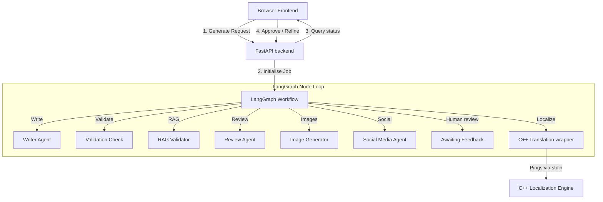

# ET-AI Content Engine — Project Structure

This document outlines the directory structure, file map, and descriptions for the **ET-AI Content Engine** project. Use this file to provide context to other AI assistants or developers.

## File Tree

```text
ET-multiple-agent/
│
├── .github/
│   └── workflows/
│       └── ci.yml               # GitHub Actions CI workflow (Ruff Linting + Pytest)
│
├── agents/                      # LangChain / LLM-powered pipeline agents
│   ├── __init__.py
│   ├── blog_writer.py           # Composes initial drafts using prompts & context
│   ├── image_generator.py       # Interacts with Bytez/Stability APIs for visual assets
│   ├── localization_wrapper.py  # Orchestrates post-approval C++ parallel translation
│   ├── rag_validator.py         # Fact-checks generated draft against vector embeddings
│   ├── review_agent.py          # Auditor validating Tone, Legal, Brand, and Policies
│   ├── scheduler.py             # Schedules metadata logs for social posts
│   ├── social_media_agent.py    # Composes branded Instagram + LinkedIn posts
│   └── web_search.py            # News crawler utilizing Tavily / NewsAPI
│
├── engine/                      # Core translation microservice
│   └── localization_agent.cpp   # C++ engine running parallel text processing
│
├── frontend/                    # Modular Single-Page Application (SPA) frontend
│   ├── index.html               # Frontend HTML shell linking CSS and JS scripts
│   ├── js/                      # Modular JavaScript controllers
│   │   ├── config.js            # Automatically resolves API urls (dev vs prod)
│   │   ├── state.js             # Controlled State manager & el() helper
│   │   ├── pipeline.js          # Polling loop, timers, and error boundaries
│   │   ├── ui.js                # Tabs, modes, resets, sticky reviews banner & renderers
│   │   └── actions.js           # Clipboard copies, downloads, uploads, and schedules
│   └── styles/                  # Modular Vanilla CSS files
│       ├── base.css             # Root variables, orbs, resets, and layout grid
│       ├── footer.css           # Telemetry footer bar styling
│       ├── header.css           # Header logos, buttons, and Crumb steps navigation
│       ├── loading.css          # Log timelines, loaders, and telemetry widgets
│       ├── results.css          # Scores, tabs, blog articles, and feedback inputs
│       └── sidebar.css          # Section labels, form fields, and checkbox switches
│
├── graph/                       # LangGraph state machine orchestration
│   ├── __init__.py
│   └── blog_graph.py            # LangGraph workflow compile nodes and transition maps
│
├── prompts/                     # Prompt templates directory
│   ├── __init__.py
│   └── blog_writer_prompt.py    # Prompts for draft generation and refinement loops
│
├── rag/                         # Retrieval-Augmented Generation configuration
│   ├── __init__.py
│   └── chroma_db/               # Local vector storage containing embeddings
│
├── scripts/                     # Legacy development and helper scripts
│   ├── README.md                # Documentation explaining legacy status of scripts
│   ├── run.bat                  # Legacy Windows batch shortcut to launch start.ps1
│   └── start.ps1                # Legacy PowerShell launcher for backend/frontend
│
├── tests/                       # Automated unit tests
│   ├── test_api.py              # Unit tests for job store and API endpoints
│   ├── test_graph_state.py      # Direct test script for translation wrapper flow
│   └── test_parser.py           # Unit tests for content parsing & metadata extraction
│
├── .dockerignore                # Excludes local caches, logs, and venvs from Docker builds
├── .env.example                 # Configuration template showing environment variables
├── .gitignore                   # Ignores venvs, local SQLite DB, log files, and builds
├── api_server.py                # FastAPI backend serving pipeline APIs
├── config.py                    # Resolves environmental configs and API keys
├── Dockerfile                   # Single-stage Docker runner based on Python 3.11-slim
├── job_store.py                 # SQLite-backed job persistence store (jobs.db)
├── main.py                      # Local CLI entrypoint for composing drafts
├── README.md                    # Project installation and details documentation
└── requirements.txt             # Pinned Python package dependencies
```

## Component Architecture



## Running the Application

### Local Development (Legacy PowerShell Script)
To launch both the FastAPI backend and Python HTTP static server together:
1. Ensure your API keys are placed in a `.env` file (copied from `.env.example`).
2. Run the startup script:
   ```powershell
   .\scripts\start.ps1
   ```
   *This will clear processes on ports 8000 and 5500, start the FastAPI API on port 8000, and start the frontend file server on port 5500 (serving the `frontend/` directory).*

> [!NOTE]
> The PowerShell script is legacy. We recommend running the application via Docker or directly using `uvicorn api_server:app --reload` to serve both the backend and frontend at `http://localhost:8000/app`.

### Docker Deployment
Build and run the container:
```bash
docker build -t et-ai-engine .
docker run -p 8000:8000 --env-file .env et-ai-engine
```
*When deployed via Docker, the FastAPI server mounts and serves the static frontend pages under the `/app` URL path.*
